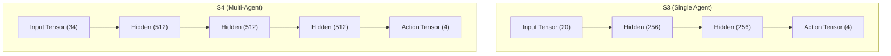

# Network Architecture
*Neural network dimensions and data flow*

## S3 Policy Network (Single-Agent)
- **Input Dimension:** 20 variables
- **Hidden Layers:** 2 layers
- **Hidden Units:** 256 per layer (`256×2`)
- **Output Dimension:** 4 continuous actions (Throttle, Roll, Pitch, Yaw)

## S4 Policy Network (Multi-Agent)
- **Input Dimension:** 34 variables
- **Hidden Layers:** 3 layers
- **Hidden Units:** 512 per layer (`512×3`)
- **Output Dimension:** 4 continuous actions (Throttle, Roll, Pitch, Yaw)

## Shared Policy in S4
In S4, a specific shared policy model structure resolves inferences for all 3 cooperative agents. The shared neural weights converge much faster than training three decentralized heads. Swarm contexts map naturally since teammate telemetry translates via relative coordinates.

## Architecture Characteristics
- **Value Network:** ML-Agents assigns a complementary parallel value network of matching layer layouts (e.g. 512x3 for S4) responsible for advantage estimations.
- **Activation Functions:** Layers employ the ML-Agents default Swish activation format optimizing spatial permutations smoothly.

## Forward Pass Diagram

## Related Docs
- [RL Algorithm](./rl_algorithm.md)
- [Overview](./overview.md)
