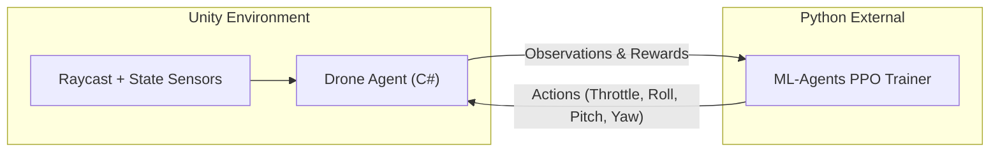

# Overview

_High-level summary of the 3D Drone SAR System_

## Introduction

The 3D Drone Search-and-Rescue (SAR) system employs Deep Reinforcement Learning (DRL) to train autonomous quadcopters to navigate complex, obstacle-dense environments and locate missing victims. The training uses Proximal Policy Optimization (PPO) via the Unity ML-Agents framework to process environmental state vectors and generate actions.

Moving from 2D to 3D navigation adds critical degrees of freedom (roll, pitch, altitude) which drastically increases both realism and the complexity of the control problem. Drones are essential for real-world SAR due to their agility, speed, and ability to enter hazardous zero-infrastructure environments, making a 3D RL-based controller highly relevant.

## System Architecture



## Repository Structure

```
g:/unity_files/Unity_ML_3DAgent/
├── allData/
│   ├── test/
│   └── train/
├── config3D/
│   ├── single_occ_ppo.yaml
│   └── multi_occ_ppo.yaml
├── doc/
├── output/
└── scripts/
    ├── single_agent_scripts/
    └── multi_agent_scripts/
```

## Configuration Comparison

| Setup  | Environment | Agents | Network Size | Observation Size | Max Steps  |
| ------ | ----------- | ------ | ------------ | ---------------- | ---------- |
| **S1** | 2D          | 1      | -            | -                | 7,970,000  |
| **S2** | 2D          | 3      | -            | -                | 10,000,000 |
| **S3** | 3D          | 1      | 256×2        | 20               | 50,000,000 |
| **S4** | 3D          | 3      | 512×3        | 34               | 50,000,000 |

## Related Docs

- [Environment and Task](./environment_and_task.md)
- [RL Algorithm](./rl_algorithm.md)
- [Reward Design](./reward_design.md)
- [Network Architecture](./network_architecture.md)
- [Multi-Agent Setup](./multi_agent.md)
- [Results](./results.md)
