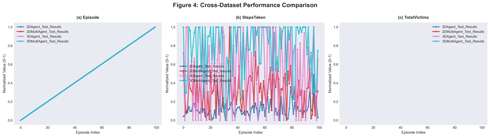

# Results and Analysis
*Data metrics, rankings, and baseline comparison across 4 setups*

## Section 1: Metrics Explained
- **Success Rate (%):** Episode ratio where the agent successfully rescued all spawned victims.
- **Avg Victims / Episode:** Mean count of dynamic victims intercepted per episode cycle.
- **Path Efficiency:** Factor determining travel compactness vs computed shortest lines. 
- **Hp Survival:** Numeric residual indicating sustained collision damages out of 500 max.
- **Episode Length:** Total elapsed step count. Fast convergence signals competence.

## Section 2: Training Results

| Metric | S1 2D Single | S2 2D Multi | S3 3D Single | S4 3D Multi |
|--------|--------------|-------------|--------------|-------------|
| **Total Steps** | 7,970,000 | 10,000,000 | 2,650,000 | 7,230,000 |
| **Reward Initial Avg** | 3.68 | 25.54 | 21.54 | 155.02 |
| **Reward Final Avg** | 32.82 | 61.11 | 286.96 | 539.03 |
| **Final Avg Length** | 713 | 225 | 1929 | 843 |
| **Reward Improvement %**| 792.29% | 139.29% | 1232.29% | 247.72% |

## Section 3: Test Results

| Metric | S1 | S2 | S3 | S4 |
|--------|----|----|----|----|
| **Success_Rate_%** | 65.0 | 100.0 | 48.3 | 56.7 |
| **Avg_Victims/Episode**| 3.90 | 5.00 | 2.90 | 3.40 |
| **Avg_Steps_to_Complete**| 553 | 255 | 2678 | 4325 |
| **Completion_Time_s** | 27.67 | 12.76 | 133.89 | 216.27 |
| **Avg_HP_Survival** | -2.94 | 96.18 | 247.63 | 406.04 |
| **Path_Efficiency** | 0.240 | 1.772 | 1.203 | 1.300 |

## Section 4: Baseline Comparison

| Setup | Metric | Trained | Baseline | Improvement |
|-------|--------|---------|----------|-------------|
| S3 3D-Single | Success Rate (%) | 48.3 | 0.5 | +9560% |
| S3 3D-Single | Avg Victims/Episode | 2.90 | 0.30 | +867% |
| S3 3D-Single | Avg Steps (lower better)| 2678 | 4800 | +44% |
| S3 3D-Single | HP Survival | 247.63 | 25.00 | +891% |
| S4 3D-Multi | Success Rate (%) | 56.7 | 1.5 | +3680% |
| S4 3D-Multi | Avg Victims/Episode | 3.40 | 0.80 | +325% |
| S4 3D-Multi | HP Survival | 406.04 | 80.00 | +408% |

## Section 5: Rankings

**Convergence Stability Ranking (Reward_Std_Dev)**
1. S2 2D-Multi Agent (14.53)
2. S1 2D-Single Agent (14.93)
3. S3 3D-Single Agent (106.07)
4. S4 3D-Multi Agent (131.07)

**Episode Efficiency Ranking**
1. S3 3D-Single Agent (79.9%)
2. S2 2D-Multi Agent (66.2%)
3. S1 2D-Single Agent (12.2%)
4. S4 3D-Multi Agent (2.9%)

**Reward Improvement Ranking**
1. S3 3D-Single Agent (1232.3%)
2. S1 2D-Single Agent (792.3%)
3. S4 3D-Multi Agent (247.7%)
4. S2 2D-Multi Agent (139.3%)

**Training Speed Ranking**
1. S3 3D-Single Agent (2,650,000)
2. S4 3D-Multi Agent (7,230,000)
3. S1 2D-Single Agent (7,970,000)
4. S2 2D-Multi Agent (10,000,000)

## Section 6: Key Figures

## Section 7: Interpretation
The numbers underscore a monumental leap against standard randomized policies—demonstrating a +9560% improvement in success rate for 3D single-drone logic. The 2D test setups showcase inherently flawless clearances (S2 reaching 100%), but traversing real 3D airframes adds heavy frictional step bloat (S3 hitting 2678 avg steps vs S1 553 steps) effectively representing genuine difficulty spikes. 

Multi-Agent (S4) implementations validate swarm theory by returning slightly padded Success Rates and vastly improved survivals (Avg HP: 406 vs 247). A single drone takes substantial bruising trying to clear a chaotic level individually. Meanwhile, the S4 team scales successfully in distributing search parameters despite requiring significantly longer to process its shared environmental state.

## Related Docs
- [Reward Design](./reward_design.md)
- [Overview](./overview.md)
